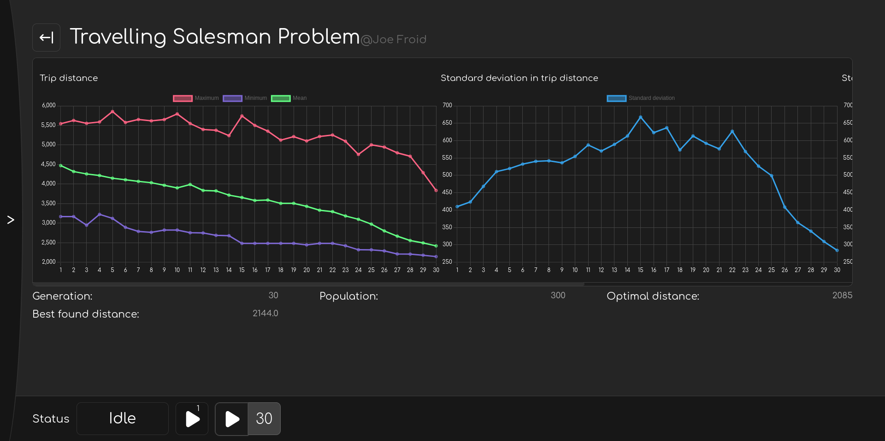

# Genetic Algorithm Visualizer - Client

This client is used to visualize Genetic Algorithms that are using a compatible protocol. One example of that can be found in [here](https://www.github.com/jamilettel/gav-server).



## Starting the server

The server uses the NextJS framework, and you can install dependencies and start it with the following commands.

To launch this server you will need yarn, which can be installed following the steps [here](https://classic.yarnpkg.com/lang/en/docs/install/#debian-stable).

```bash
# install dependencies
yarn install
# launch in production environment
yarn build && yarn start
#launch in development environment
yarn dev
```

## Usage

When launching the server, you can choose the URL of the GA server that you want to connect to. 
After that, you can join a session, and then all the required information and interactions you can have will be shown on screen.

## Followed protocols

This client connects to websocket servers follow the [General Protocol](./Protocol/GENERAL_PROTOCOL.md).

## Description of features

As of now, the only supported sub protocol (as of now) is the [Generic Protocol](./Protocol/GENERIC_PROTOCOL.md).
Thus, this section will only be covering the featuers that are available for the Generic Protocol.

### Statistics

The statistics view shows the overall performance of your current run. It contains graphs and general statistics that can be configured in the server.
Usually you would have fitness graphs, diversity graphs, and other performance related graphs.

### Settings

The settings page lets you change the settings of the algorithm mid-run. These settings are be algorithm specific.
Once a setting has been changed, you are given the option of saving the settings, or discarding them.

#### Presets

You can choose the preset when creating a new session, and they will be applied once the session is created.
To create a new preset, you should go to the "Change Settings" menu in the navigation menu, and create it
in the action bar.
Once you've selected the settings you want to add to your preset, enter your preset name and click on the `+` button.

You can then import your preset, overwrite it, or delete it.

Presets are saved locally in `localStorage` and will only be accessible to you. They will disappear if you clear
your cookies.

### Population

The Population page lets you view the population in every generation. You are able to see how the 
chromosome was created, its age, its ID, its fitness, as well as the data inside chromosome.

By clicking on an individual in the population, you access more details about that individual,
you can see its parents (if applicable), the chromosome it mutated from (if applicable).

If possible, you will also be given the option to view the origin of the parent or original 
chromosome before mutation.

This way, you can trace the origin of the chromosome down to the very first generation.

The back button in the popup will make you go back one step in the stack,
whereas clicking on the blurry background will close the popup.

### Settings changelog

In the settings changelog, you can at what generation every settings was changed.

### Deleting session

You can delete the session when you are done using it.
It will remove it from the server, and you won't be able to access it again.
